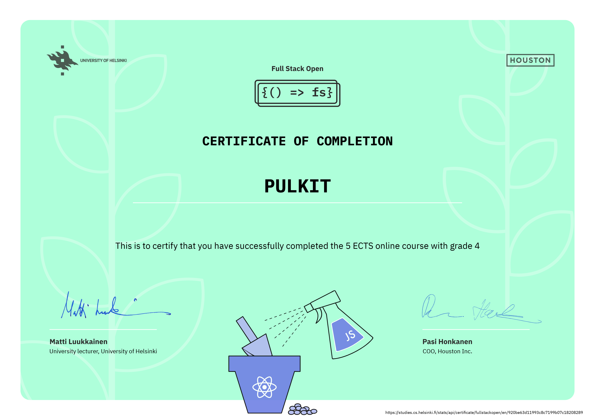

# This is [Pulkitxm's](https://devpulkit.vercel.app/) [FullStackOpen](https://fullstackopen.com) Course's Reposittory

There are 13 parts in the course and this repository contains all the exercises of it in there separate directories . To locate a specific question of a part there is a dedicated commit 
Ex - to read the solution of first question of third part you can search a commit like p3q1

## Tech Stack Learned
- React
- Node.js
- Express.js
- MongoDB
- ESLint
- Bycrypt (Saltrounds and encryption for passwords)
- Jest (Testing by Facebook)
- Cypress (End-to-End testing)
- Redux (State Management Tools)
- React-query (Transact Query, managing and storing data retrieved from the server)

## Course Structure

### Part-0: Fundamentals of Web Apps
- Introduction to the course, outlining its structure, objectives, and requirements.
- Explanation of the course process, including lectures, assignments, and any project work.
- Overview of the submission criteria and assessment methods used in the course.
- Understanding the basic logic of running web applications, including the client-server model.
- Introduction to the concept of AJAX (Asynchronous JavaScript and XML) for making asynchronous requests in web applications.
- Explanation of the meaning of "full-stack web development," which encompasses both the front-end and back-end aspects of web applications.

### Part-1: Introduction to React
- Learn the basics of React, including setting up a project with `create-react-app`.
- Understand the concept of components in React and how to create them.
- Gain a solid grasp of fundamental JavaScript concepts like arrays, objects, and functions.
- Explore the `useState` hook for managing state within React components.
- Understand how changes in state trigger page re-rendering.
- Dive into more complex state management within React applications.

### Part-2: Communicating with Server
- Learn how to use React to communicate with a server, a crucial skill in web development.
- Discover the Fetch API for making HTTP requests from a React application.
- Learn to parse JSON responses received from the server.
- Explore the use of React hooks for managing state while interacting with the server.

### Part-3: Programming a Server with Node.js and Express
- Create a basic Express server for server-side development using Node.js.
- Handle HTTP requests, including GET and POST requests.
- Learn how to return JSON responses from the server.

### Part-4: Testing Express Servers and User Administration
- Write unit tests to ensure the correctness of your Express server code.
- Use Express middleware to handle user authentication and authorization.

### Part-5: Testing React Apps
- Write unit tests for your React components, ensuring they work as expected.
- Implement integration tests to check how React components interact with a server.

### Part-6: Advanced State Management
- Utilize the Redux library for centralized state management in your React applications.
- Learn about the React Context API to share state between components.

### Part-7: React Router, Custom Hooks, Styling App with CSS, and Webpack
- Use the React Router to enable navigation between different pages in your application.
- Create custom hooks to encapsulate and reuse common functionality.
- Leverage Webpack for bundling your React code.

### Part-8: GraphQL
- Explore GraphQL, a more flexible and efficient approach to creating and querying APIs.
- Understand the advantages of using GraphQL compared to traditional REST APIs.

### Part-9: TypeScript
- Use TypeScript to write more reliable and maintainable JavaScript code.
- Realize the benefits of using TypeScript for static typing.

### Part-10: React Native
- Build simple mobile applications using React Native, allowing you to develop for multiple platforms with a single codebase.
- Use React Native components to render UI elements natively on mobile platforms.

### Part-11: CI/CD
- Implement Continuous Integration and Continuous Deployment (CI/CD) tools to automate the software development and delivery process.
- Discover the numerous benefits of using CI/CD for faster and more reliable software releases.

### Part-12: Containers
- Learn how to use Docker to create and deploy containers, making applications highly portable and isolated.
- Understand the benefits of containerization in modern software development.

### Part-13: Using Relational Databases
- Use Sequelize, an ORM (Object-Relational Mapping) library, to connect to and interact with relational databases.
- Write SQL queries and manage database migrations, essential for data persistence in applications.